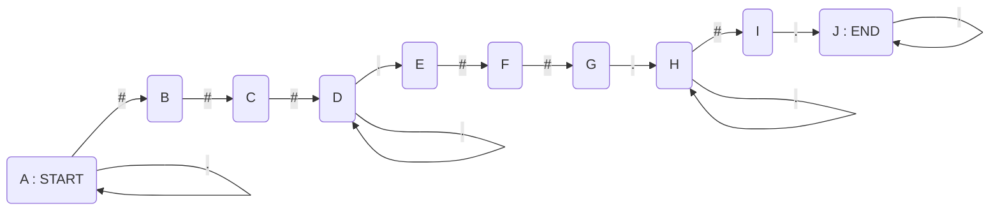

<style>
.final_image {
  display: contents !important
}
.final_image img {
  width: 49%!important
}
.scroll .highlight {
  max-height: 400px; /* Change to your desired max height */
  overflow-y: scroll;
}
</style>

## The Problem

[Advent of Code 2023 Day 12](https://adventofcode.com/2023/day/5) presents us with lists of gears which can either be functional `.`, broken `#`, or undetermined `?`, as well as a list of how many broken gears are in a row.
For example, if we have the list of broken gears `2 3 1`, then the list of gears `.##...###....#.` would be a valid matching list, but `##..####..#.` would not be.

Of course we don't know whether or not the undetermined gears are broken or not, so we are tasked with figuring out how many possibilities of the undetermined gears being broken or functional would match the broken gear list.

From the website's examples: `.??..??...?##. 1,1,3` would have 4 possible combinations, which are:

1. `.#...#....?##.`
2. `.#....#...?##.`
3. `..#..#....?##.`
4. `..#...#...?##.`


## Part 1: The simple way

The most intuitive way to solve this is to do a sort of recursive solution. Start by iterating over the initial string. When you reach a ?, turn it into a broken gear, continue (via recursion). Then when it either succeeds or fails, change that gear into a functioning gear, then re-continue. A general code skeleton would look like:

```python
def solve(string):
    solution = 0

    for i in range(len(string)):
        if string[i] != '?':
            continue
        string[i] = '#'
        solution += solve(string)
        string[i] = '.'
        return solution + solve(string)
    
    if is_valid(string):
      return 1
    return 0
```

Now ignoring for a moment that this can be much better optimized, this gives us an idea of how execution time would scale with the size of the input, in other words, the Big-O. In general, for each `?` we split the iteration into two, doubling the number of iterations per question mark. making the Big-O of this approach $$ O(n * 2^m) $$ where $$ n $$ represents the size of the string and $$ m $$ represents the number of undetermined gears.

Now contrary to popular belief, a large Big-O doesn't necessarily mean that the algorithm is slow, it only expresses how it grows with larger inputs. Bubble sort is the fastest sort on small lists after all. But also in the above skeleton, there a *many* ways to make this faster while still being $$ O(n * 2^m) $$

Even if we use Big-O as a straight up measurement, the longest string in the dataset is $$ 20 $$ and the most amount of undetermined gears are $$ 18 $$, which results in approximately $ 5242880 $ "units" of work per line, which in computer time is *nothing*. That being said, there is always part 2...

## Part 2: Where Big-O Bites You in the Ass

Oh whoops, the data input is folded. The *actual* input is the result of repeating the string 5 times with an additional undetermined gear in-between each of them, as well as the broken gear list is also repeated 5 times.

`.??..??...?##. 1,1,3` from the original example is *actually*
 
`.??..??...?##.?.??..??...?##.?.??..??...?##.?.??..??...?##.?.??..??...?##. 1,1,3,1,1,3,1,1,3,1,1,3,1,1,3` while going from 4 possibilities to 16384 valid configuration.

So uh, remember how I mentioned Big-O represents how well an algorithm scales, well now the longest string is 104 characters, and the most amount of undetermined gears is 94, which requires 2,059,932,225,370,872,777,432,142,708,736 "units" of work. So not likely to be accomplished in our life times, so here is where we need to be clever.

## Solving Part 2 Using Deterministic Finite Automata

So many people use [Dynamic Programming](https://en.wikipedia.org/wiki/Dynamic_programming) along with the recursive solution to cut down on repeated states, so it can ***massively*** cut down on computation. This is not the technique I used, I took a completely different approach.

The relentless and gratuitous back an for reminded me of a video I watched a while ago about how one bad regex stalled CloudFlare. Specifically the chapter "Part 5: Root Cause".



It then occurred to me that whether or not a final configuration is valid is a simple regex depending on the broken gear list.

For example, let's use the line `?###???????? 3,2,1` which has 10 possible configurations. The broken gear list `3,2,1` results in the regex `.*###.+##.+#.*` (in this case `.` is the literal `.` and not the wild card).

Well what does this get us? In university, when we were studying the theory of computation, we learned that both DFAs (Deterministic Finite Automata) and Regular Expressions both express regular expressions, so any regular expressions can be expressed as a DFA, and luckily, this DFA is fairly trivial:



Now we have the DFA... so what? All this does is check the validity of a certain configuration, and it doesn't even handle undetermined gears. Luckily it doesn't need to.
If we imagine a head moving from state to state as we go through each character, whenever we reach a question mark, we just... split the head, and now we have two heads. You would think that this would lead to the same splitting problem, but it doesn't for two reasons.

1. We only go through the string once
2. We can group every head together, and instead keep track of how many heads are at each state, as all heads in a given state will follow the same path.

As an example, let's use the `?###????????` string as an example

| States | Start | ? | # | # | # | ? | ? | ? | ? | ? | ? | ? | ? |
|--------|-------|---|---|---|---|---|---|---|---|---|---|---|---|
| A | 1 | 1 | 0 | 0 | 0 | 0 | 0 | 0 | 0 | 0 | 0 | 0 | 0 |
| B | 0 | 1 | 1 | 0 | 0 | 0 | 0 | 0 | 0 | 0 | 0 | 0 | 0 |
| C | 0 | 0 | 1 | 1 | 0 | 0 | 0 | 0 | 0 | 0 | 0 | 0 | 0 |
| D | 0 | 0 | 0 | 1 | 1 | 0 | 0 | 0 | 0 | 0 | 0 | 0 | 0 |
| E | 0 | 0 | 0 | 0 | 0 | 1 | 1 | 1 | 1 | 1 | 1 | 1 | 1 |
| F | 0 | 0 | 0 | 0 | 0 | 0 | 1 | 1 | 1 | 1 | 1 | 1 | 1 |
| G | 0 | 0 | 0 | 0 | 0 | 0 | 0 | 1 | 1 | 1 | 1 | 1 | 1 |
| H | 0 | 0 | 0 | 0 | 0 | 0 | 0 | 0 | 1 | 2 | 3 | 4 | 5 |
| I | 0 | 0 | 0 | 0 | 0 | 0 | 0 | 0 | 0 | 1 | 2 | 3 | 4 |
| J | 0 | 0 | 0 | 0 | 0 | 0 | 0 | 0 | 0 | 0 | 1 | 3 | 6 |

Then after going through the entire string, all we have to do is count the number of heads that reached one of the valid end states (the last two rows).

In this case 4 + 6 = the 10 possible configuration.
Also if you are curious about the part 2 version of this, below is a printout of the counts for each state after each character. It is too large to format into a table

```
AA | 1

AA | 1
AB | 1

AB | 1
AC | 1

AC | 1
AD | 1

AD | 1

AE | 1

AE | 1
AF | 1

AE | 1
AF | 1
AG | 1

AE | 1
AF | 1
AG | 1
AH | 1

AE | 1
AF | 1
AG | 1
AH | 2
AI | 1

AE | 1
AF | 1
AG | 1
AH | 3
AI | 2
AJ | 1

AE | 1
AF | 1
AG | 1
AH | 4
AI | 3
AJ | 3
AK | 1

AE | 1
AF | 1
AG | 1
AH | 5
AI | 4
AJ | 6
AK | 3
AL | 1

AE | 1
AF | 1
AG | 1
AH | 6
AI | 5
AJ | 10
AK | 6
AL | 3
AM | 1

AE | 1
AF | 1
AG | 1
AH | 7
AI | 6
AJ | 15
AK | 10
AL | 6
AM | 3
AN | 1

AF | 1
AG | 1
AI | 7
AK | 15
AL | 10
AM | 6
AO | 1

AG | 1
AL | 15
AM | 10
AP | 1

AM | 15

AN | 15

AN | 15
AO | 15

AN | 15
AO | 15
AP | 15

AN | 15
AO | 15
AP | 15
AQ | 15

AN | 15
AO | 15
AP | 15
AQ | 30
AR | 15

AN | 15
AO | 15
AP | 15
AQ | 45
AR | 30
AS | 15

AN | 15
AO | 15
AP | 15
AQ | 60
AR | 45
AS | 45
AT | 15

AN | 15
AO | 15
AP | 15
AQ | 75
AR | 60
AS | 90
AT | 45
AU | 15

AN | 15
AO | 15
AP | 15
AQ | 90
AR | 75
AS | 150
AT | 90
AU | 45
AV | 15

AN | 15
AO | 15
AP | 15
AQ | 105
AR | 90
AS | 225
AT | 150
AU | 90
AV | 45
AW | 15

AO | 15
AP | 15
AR | 105
AT | 225
AU | 150
AV | 90
AX | 15

AP | 15
AU | 225
AV | 150
AY | 15

AV | 225

AW | 225

AW | 225
AX | 225

AW | 225
AX | 225
AY | 225

AW | 225
AX | 225
AY | 225
AZ | 225

AW | 225
AX | 225
AY | 225
AZ | 450
BA | 225

AW | 225
AX | 225
AY | 225
AZ | 675
BA | 450
BB | 225

AW | 225
AX | 225
AY | 225
AZ | 900
BA | 675
BB | 675
BC | 225

AW | 225
AX | 225
AY | 225
AZ | 1125
BA | 900
BB | 1350
BC | 675
BD | 225

AW | 225
AX | 225
AY | 225
AZ | 1350
BA | 1125
BB | 2250
BC | 1350
BD | 675
BE | 225

AW | 225
AX | 225
AY | 225
AZ | 1575
BA | 1350
BB | 3375
BC | 2250
BD | 1350
BE | 675
BF | 225

AX | 225
AY | 225
BA | 1575
BC | 3375
BD | 2250
BE | 1350
BG | 225

AY | 225
BD | 3375
BE | 2250
BH | 225

BE | 3375

BF | 3375

BF | 3375
BG | 3375

BF | 3375
BG | 3375
BH | 3375

BF | 3375
BG | 3375
BH | 3375
BI | 3375

BF | 3375
BG | 3375
BH | 3375
BI | 6750
BJ | 3375

BF | 3375
BG | 3375
BH | 3375
BI | 10125
BJ | 6750
BK | 3375

BF | 3375
BG | 3375
BH | 3375
BI | 13500
BJ | 10125
BK | 10125
BL | 3375

BF | 3375
BG | 3375
BH | 3375
BI | 16875
BJ | 13500
BK | 20250
BL | 10125
BM | 3375

BF | 3375
BG | 3375
BH | 3375
BI | 20250
BJ | 16875
BK | 33750
BL | 20250
BM | 10125
BN | 3375

BF | 3375
BG | 3375
BH | 3375
BI | 23625
BJ | 20250
BK | 50625
BL | 33750
BM | 20250
BN | 10125
BO | 3375

BG | 3375
BH | 3375
BJ | 23625
BL | 50625
BM | 33750
BN | 20250
BP | 3375

BH | 3375
BM | 50625
BN | 33750
BQ | 3375

BN | 50625

BO | 50625

BO | 50625
BP | 50625

BO | 50625
BP | 50625
BQ | 50625

BO | 50625
BP | 50625
BQ | 50625
BR | 50625

BO | 50625
BP | 50625
BQ | 50625
BR | 101250
BS | 50625

BO | 50625
BP | 50625
BQ | 50625
BR | 151875
BS | 101250
BT | 50625

BO | 50625
BP | 50625
BQ | 50625
BR | 202500
BS | 151875
BT | 151875

BO | 50625
BP | 50625
BQ | 50625
BR | 253125
BS | 202500
BT | 303750

```
{: .scroll}

In regards to the Big-O, there is the outer iteration of the characters of the string, and the inner iteration at most the total number of states, which equals $$ m = size(broken) + sum(broken) + 1 $$ making the Big-O $$ O(n*m) $$

Keep in mind that for my inputs, the largest number of states I had to deal with was 101. That with the longest string being 104, each line take no more than 10504 "units" of work.

## The Code

Here is the code for the DFA class.
I decided to just have a pre-allocated vector of states, so that I can use the pointers to the states both as a key for the counting map, but also as a way to connect states to each other.
So a state consists of pointers for where to go if you read a dot or a hash, and a bool to represent the valid end states;

I start by have the 0th state point to itself when it sees a dot, and move forward with a hash.
Then I loop one less then the number of hashes expected, linking them up, then link up the next dot states, and repeat.

At the end, I mark the two last states as valid and that is done;

```cpp
struct DFA {
    struct state {
        state* dot{};
        state* hash{};
        bool valid{};
    };

    std::vector<state> states;

    explicit NFA(const std::vector<int>& broken_pattern) : states(
              std::accumulate(broken_pattern.begin(), broken_pattern.end(), 0) + int(broken_pattern.size())  + 1) {
        states[0].dot = &states[0];
        states[0].hash = &states[1];

        int i = 1;
        for (auto& b : broken_pattern) {
            for (int j = 0; j < b - 1; ++i, ++j) {
                states[i].hash = &states[i + 1];
            }
            states[i].dot = &states[i + 1];
            ++i;
            states[i].dot = &states[i];
            if (i + 1 < int(states.size()))
                states[i].hash = &states[i + 1];
            ++i;
        }

        states[states.size() - 1].valid = true;
        states[states.size() - 2].valid = true;
    }

    [[nodiscard]] size_t count(const std::string& match) const;
}
```

For the actual counting loop, it is fairly straightforward.
I create a state -> count map to hold the current heads.
I loop over each character of the string, creating a new map for the new head counts.
for each head in the current map, depending on the character, I add its value to the state it points to for the next loop.
I assign the new map to the current then keep on going.

The last line is a bit of c++ mess, but hey, what can ya do. (A lot probably)
Anyway, it loops over the final head map, then adds together only the counts associated with valid end states.


```cpp
size_t DFA::count(const std::string& match) const {
    using maptype = std::unordered_map<const state*, size_t>;
    maptype curr{{&states[0], 1zu}};
    for (char c : match) {
        next.reserve(states.size());
        for (auto& [key, value] : curr) {
            if ((c == '.' || c == '?') && key->dot)
                next[key->dot] += value;
            if ((c == '#' || c == '?') && key->hash)
                next[key->hash] += value;
        }
        curr = std::move(next);
    }
    auto x = std::accumulate(curr.end() - 2, curr.end(), 0zu, [](size_t res, const maptype::value_type& m) {
        return res + (m.first->valid ? m.second : 0zu);
    });
    return x;
}
```

And that is it. That is how I used DFAs to allow me to only have to iterate over the strings once.
The full code can be found [here](https://github.com/AlexOxorn/AdventOfCode/blob/main/puzzles/2023/src/day12.cpp)